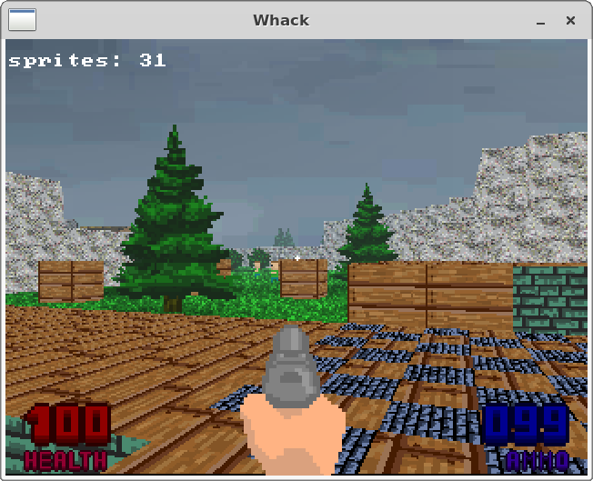
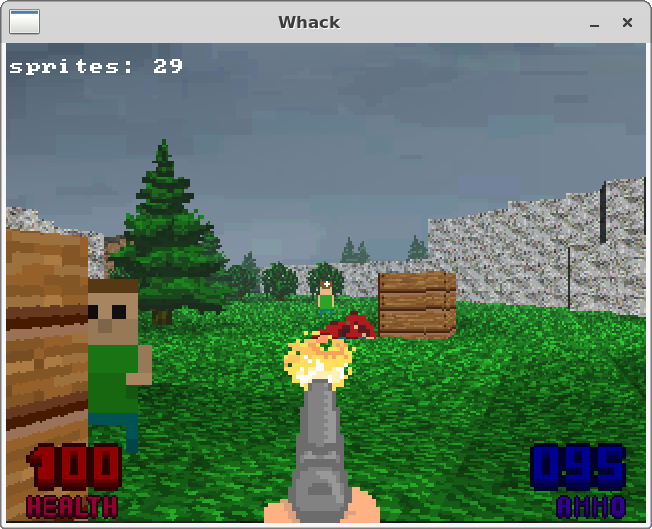
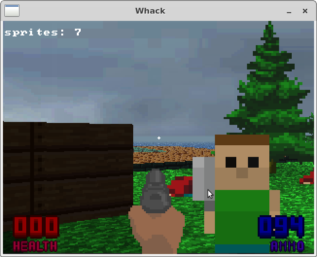
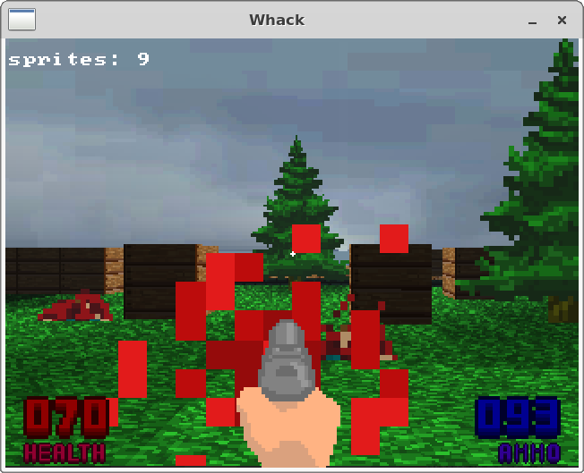
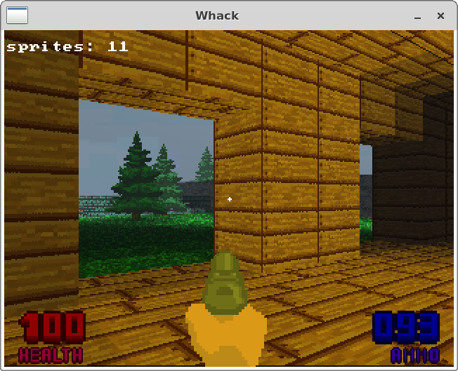
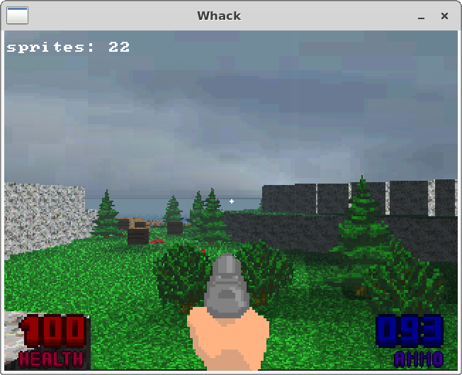

Unfinished and long ago abandoned first person shooter with Wolfenstein-like path tracing rendering enigne that started out as a school project. Scavenging sources just for laughs.

Building:

```
$ cd deps
$ ./build.sh linux && cd -
$ qbs
```

Everything here is under WTFPL license.

Some screen shots:







